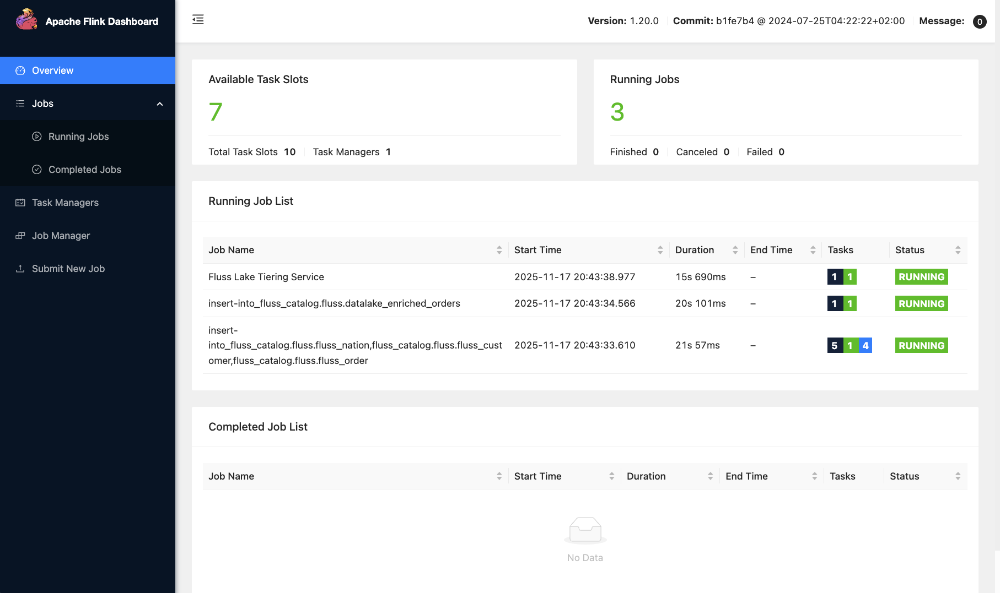

# Streaming Lakehouse Playground with Flink, Fluss, and Lance(DB)

This containerized playground provides a quick and convenient way to experiment with a streaming lakehouse architecture using Apache Flink, Apache Fluss, and Lance(DB) on your local machine.

## Components

1. **Apache Flink / SQL:** uses a faker data source connector to generate a synthetic stream of order related data across 3 tables (`source_order`,`source_customer`, `source_nation`)
2. **Apache Fluss:** as streaming storage for real-time analytics with configured lakehouse tiering
3. **Lance:** - used as lakehouse table format backed by object storage (MinIO)
4. **LanceDB API Server** - a very basic custom service wrapper (Python FastAPI) around LanceDB to directly query the streaming lakehouse via HTTP

## Quick Start

### Run the Stack

Open a terminal window in the root directory of this repository and run

```bash
docker compose up
```

During the very first run, this will build the container image for the LanceDB API Server and then start the containers for all involved data infra components accordingly. After a few moments, you should have the following 7 containers up and running locally:

```
CONTAINER ID   IMAGE                                               COMMAND                  CREATED              STATUS              PORTS                                                             NAMES
432cf5140af1   apache/fluss:0.8.0-incubating                       "/docker-entrypoint.…"   About a minute ago   Up About a minute                                                                     streaming-lakehouse-playground-tablet-server-1
ea8e5de55f3b   streaming-lakehouse-playground-taskmanager          "/docker-entrypoint.…"   About a minute ago   Up About a minute   6123/tcp, 8081/tcp                                                streaming-lakehouse-playground-taskmanager-1
e05e5a54c992   apache/fluss:0.8.0-incubating                       "/docker-entrypoint.…"   About a minute ago   Up About a minute                                                                     streaming-lakehouse-playground-coordinator-server-1
5840ff3b2199   streaming-lakehouse-playground-jobmanager           "/docker-entrypoint.…"   About a minute ago   Up About a minute   0.0.0.0:8083->8081/tcp, [::]:8083->8081/tcp                       streaming-lakehouse-playground-jobmanager-1
f39ece66b456   zookeeper:3.9.2                                     "/docker-entrypoint.…"   About a minute ago   Up About a minute   2181/tcp, 2888/tcp, 3888/tcp, 8080/tcp                            streaming-lakehouse-playground-zookeeper-1
d33d13eb9537   streaming-lakehouse-playground-lancedb-api-server   "python server.py"       About a minute ago   Up About a minute   0.0.0.0:8000->8000/tcp, [::]:8000->8000/tcp                       streaming-lakehouse-playground-lancedb-api-server-1
e9b892ea317e   minio/minio:RELEASE.2025-09-07T16-13-09Z            "/usr/bin/docker-ent…"   About a minute ago   Up About a minute   0.0.0.0:9000-9001->9000-9001/tcp, [::]:9000-9001->9000-9001/tcp   streaming-lakehouse-playground-minio-1
```

### Start Streaming

Open another terminal window in the root directory of this repository and run

```bash
./start_streaming.sh
```
which will launch the Flink SQL jobs and the Fluss Lakehouse tiering job. Also, this script will directly open the Flink Web Dashboard showing the 3 jobs that have just been started.



### Inspect Object Storage

As the Fluss Tiering Job ingests data you should see your lakehouse grow. After a minute or two, you can inspect the raw object storage (S3/MinIO) which backs the Lance table format every once in a while like so:

```bash
docker compose exec minio bash -c "mc alias set myminio http://minio:9000 admin minio12345"

while true; do
  echo "🔎 checking lakehouse storage at $(date)"
  docker compose exec minio bash -c "mc ls myminio/fluss-lakehouse/fluss/datalake_enriched_orders.lance/data"
  echo "😴 for a while..."
  sleep 30
done
```

which after a few minutes shows output similar to this:

```log
🔎 checking lakehouse storage at Mon Nov 17 21:09:19 CET 2025
[2025-11-17 20:03:12 UTC] 410KiB STANDARD 29af0da0-a4c4-4e77-80e0-c333a967141a.lance
[2025-11-17 20:02:42 UTC] 394KiB STANDARD 37537bf8-0a0c-40ba-9c55-f733c125efe6.lance
[2025-11-17 20:04:42 UTC] 404KiB STANDARD 6a285522-82c6-4635-8757-db81772f5368.lance
[2025-11-17 20:04:12 UTC] 389KiB STANDARD 8491075f-8593-4d17-8afe-1f75902d8c12.lance
[2025-11-17 20:03:42 UTC] 400KiB STANDARD 8a7ede39-1b63-4429-aa02-45c694175aed.lance
[2025-11-17 20:01:43 UTC] 452KiB STANDARD a6c83d13-c967-473b-b1f4-09b71ca1d680.lance
[2025-11-17 20:02:12 UTC] 404KiB STANDARD f87c1cdf-ae18-40e1-a42e-3489ff24bcf9.lance
😴 for a while...
```

### LanceDB Queries

LanceDB is typically meant to run in embedded mode. However, to ease data access to the lakehouse for any non-native clients you can query your lance data via the simplest possible custom REST wrapper using your favorite HTTP tool.

For instance, use `curl` and `jq` to interactively query your streaming lakehouse like so:

#### List available tables

Our lakehouse tiering service is configured to ingest only a single table so far.

```bash
curl -s  'localhost:8000/tables' | jq .
```

```json
{
  "tables": [
    "datalake_enriched_orders"
  ]
}
```

#### Inspect the table schema

```bash
curl -s 'localhost:8000/tables/datalake_enriched_orders' | jq -r '.schema'
```

```text
order_key: int64
cust_key: int32 not null
total_price: decimal128(15, 2)
order_date: date32[day]
order_priority: string
clerk: string
cust_name: string
cust_phone: string
cust_acctbal: decimal128(15, 2)
cust_mktsegment: string
nation_name: string
```

#### Query the table data

Fetch at most 10 orders from customer having `cust_key=11` and `order_priority='high'`:

```bash
curl -s 'localhost:8000/tables/datalake_enriched_orders/query?query=cust_key%3D11%20AND%20order_priority%3D%27high%27&limit=10' | jq .
```

```json
{
  "results": [
    {
      "order_key": 92471679,
      "cust_key": 11,
      "total_price": 127.81,
      "order_date": "2025-11-13",
      "order_priority": "high",
      "clerk": "Clerk3",
      "cust_name": "Ron A. Muck",
      "cust_phone": "802-580-1312",
      "cust_acctbal": 652.6,
      "cust_mktsegment": "AUTOMOBILE",
      "nation_name": "CANADA"
    },
    {
      "order_key": 55176197,
      "cust_key": 11,
      "total_price": 528.23,
      "order_date": "2025-09-25",
      "order_priority": "high",
      "clerk": "Clerk4",
      "cust_name": "Ron A. Muck",
      "cust_phone": "802-580-1312",
      "cust_acctbal": 652.6,
      "cust_mktsegment": "AUTOMOBILE",
      "nation_name": "CANADA"
    },
    {
      "order_key": 15888550,
      "cust_key": 11,
      "total_price": 829.53,
      "order_date": "2025-10-05",
      "order_priority": "high",
      "clerk": "Clerk3",
      "cust_name": "Ron A. Muck",
      "cust_phone": "802-580-1312",
      "cust_acctbal": 652.6,
      "cust_mktsegment": "AUTOMOBILE",
      "nation_name": "CANADA"
    },
    {
      "order_key": 17337015,
      "cust_key": 11,
      "total_price": 174.34,
      "order_date": "2025-10-17",
      "order_priority": "high",
      "clerk": "Clerk3",
      "cust_name": "Ron A. Muck",
      "cust_phone": "802-580-1312",
      "cust_acctbal": 652.6,
      "cust_mktsegment": "AUTOMOBILE",
      "nation_name": "CANADA"
    },
    {
      "order_key": 31010747,
      "cust_key": 11,
      "total_price": 806.38,
      "order_date": "2025-09-04",
      "order_priority": "high",
      "clerk": "Clerk3",
      "cust_name": "Ron A. Muck",
      "cust_phone": "802-580-1312",
      "cust_acctbal": 652.6,
      "cust_mktsegment": "AUTOMOBILE",
      "nation_name": "CANADA"
    },
    {
      "order_key": 23348181,
      "cust_key": 11,
      "total_price": 242.81,
      "order_date": "2025-11-11",
      "order_priority": "high",
      "clerk": "Clerk1",
      "cust_name": "Ron A. Muck",
      "cust_phone": "802-580-1312",
      "cust_acctbal": 652.6,
      "cust_mktsegment": "AUTOMOBILE",
      "nation_name": "CANADA"
    },
    {
      "order_key": 95303398,
      "cust_key": 11,
      "total_price": 973.15,
      "order_date": "2025-10-08",
      "order_priority": "high",
      "clerk": "Clerk2",
      "cust_name": "Ron A. Muck",
      "cust_phone": "802-580-1312",
      "cust_acctbal": 652.6,
      "cust_mktsegment": "AUTOMOBILE",
      "nation_name": "CANADA"
    },
    {
      "order_key": 5962768,
      "cust_key": 11,
      "total_price": 242.65,
      "order_date": "2025-10-14",
      "order_priority": "high",
      "clerk": "Clerk3",
      "cust_name": "Ron A. Muck",
      "cust_phone": "802-580-1312",
      "cust_acctbal": 652.6,
      "cust_mktsegment": "AUTOMOBILE",
      "nation_name": "CANADA"
    },
    {
      "order_key": 1631955,
      "cust_key": 11,
      "total_price": 72.84,
      "order_date": "2025-09-02",
      "order_priority": "high",
      "clerk": "Clerk4",
      "cust_name": "Ron A. Muck",
      "cust_phone": "802-580-1312",
      "cust_acctbal": 652.6,
      "cust_mktsegment": "AUTOMOBILE",
      "nation_name": "CANADA"
    },
    {
      "order_key": 4446614,
      "cust_key": 11,
      "total_price": 334.37,
      "order_date": "2025-08-27",
      "order_priority": "high",
      "clerk": "Clerk1",
      "cust_name": "Ron A. Muck",
      "cust_phone": "802-580-1312",
      "cust_acctbal": 652.6,
      "cust_mktsegment": "AUTOMOBILE",
      "nation_name": "CANADA"
    }
  ],
  "count": 10,
  "total": 7847
}
```
